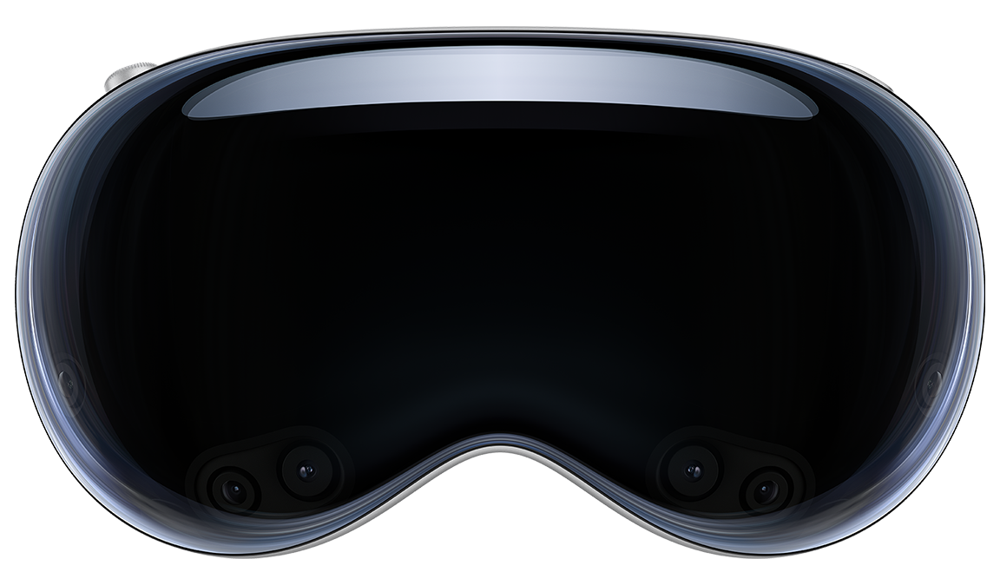
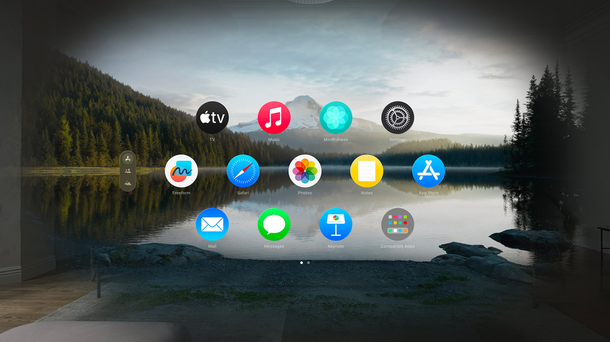
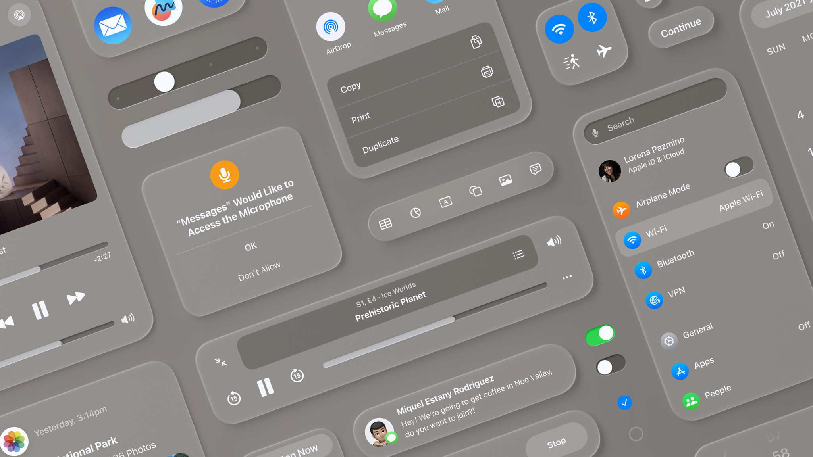
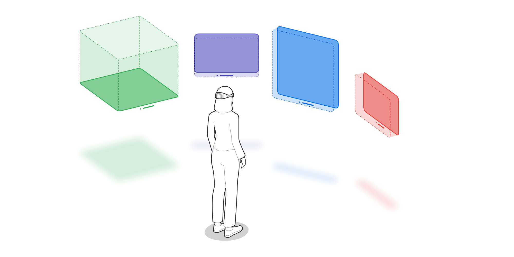

# visionOS



The goal of this project is to create a visionOS-style web personal homepage that allows us to experience the visual experience of Apple Vision Pro on the front-end as well. This project will use Vue3, TypeScript, Lottie, and other technologies to create a visually stunning and interactive experience.

这个项目的目标是创建一个 visionOS 风格的 Web 个人主页，使我们在前端也能体验 Apple Vision Pro 的视觉体验。此项目将使用 Vue3、TypeScript、Lottie 等技术，创建一个视觉上令人惊叹和交互式的体验。


Another reason for creating this project is to enhance my coding skills, such as trying and practicing new techniques or interesting coding implementations (such as Vue3, TypeScript, Lottie, etc.). If you find it interesting, you can light up the "Star" button in this repository. Of course, you are also welcome to contribute to this project, provide interesting suggestions, or participate in the coding of the project.

这个项目创建的另一个原因是为了提升我的编码技术，例如尝试和锻炼一些新技术或有趣的编码实现方式（如 Vue3、TypeScript 和 Lottie 等），如果觉得有趣可以点亮此存储库的“Star”按钮。当然，也欢迎你为此项目做出贡献，提出有趣的建议，或者参与进项目的编码。



The project is currently in the design and development phase, and the project will be updated continuously. The project will be divided into several stages, and the project will be updated with new features and improvements at each stage.

项目目前处于设计和开发阶段，将持续更新。项目将分为几个阶段，每个阶段将会更新新的功能和改进。



## Optional Features

This project was created through [create-vue](https://github.com/vuejs/create-vue), the official Vue project scaffolding tool.

- [x] Add TypeScript
- [ ] Add JSX Support
- [x] Add Vue Router for Single Page Application development
- [x] Add Pinia for state management
- [ ] Add Vitest for Unit testing
- [ ] Add an End-to-End Testing Solution
- [x] Add ESLint for code quality
- [x] Add Prettier for code formatting
- [ ] Add Vue DevTools 7 extension for debugging (experimental)

## Recommended IDE Setup

[VSCode](https://code.visualstudio.com/) + [Volar](https://marketplace.visualstudio.com/items?itemName=Vue.volar) (and disable Vetur).

## Type Support for `.vue` Imports in TS

TypeScript cannot handle type information for `.vue` imports by default, so we replace the `tsc` CLI with `vue-tsc` for type checking. In editors, we need [Volar](https://marketplace.visualstudio.com/items?itemName=Vue.volar) to make the TypeScript language service aware of `.vue` types.

## Customize configuration

See [Vite Configuration Reference](https://vitejs.dev/config/).

## Project Setup

```sh
pnpm install
```

### Compile and Hot-Reload for Development

```sh
pnpm run dev
```

### Type-Check, Compile and Minify for Production

```sh
pnpm run build
```

### Lint with [ESLint](https://eslint.org/)

```sh
pnpm run lint
```

## Stargazers over time

[](https://starchart.cc/Barry-Flynn/visionOS)

### Design Reference

- [Apple Vision Pro](https://www.apple.com/apple-vision-pro/)

- [Learn more about developing for visionOS](https://developer.apple.com/visionos/)

- [Design for visionOS](https://developer.apple.com/visionos/pathway/#design)

- [Spotlight on: Developing for visionOS](https://developer.apple.com/news/?id=h3qjwosp) (June 5, 2023)

- [Spotlight on: Developer tools for visionOS](https://developer.apple.com/news/?id=765ce4l3) (June 21, 2023)

- [Q&A: Spatial design for visionOS](https://developer.apple.com/news/?id=fi8ne6ji) (December 7, 2023)

- [Q&A: Building apps for visionOS](https://developer.apple.com/news/?id=prl6dp5r) (January 11, 2024)



## License

[MIT License](https://github.com/Barry-Flynn/visionOS/blob/main/LICENSE)

Copyright (c) 2024-present [Barry-Flynn](https://github.com/Barry-Flynn) (百里飞洋)
